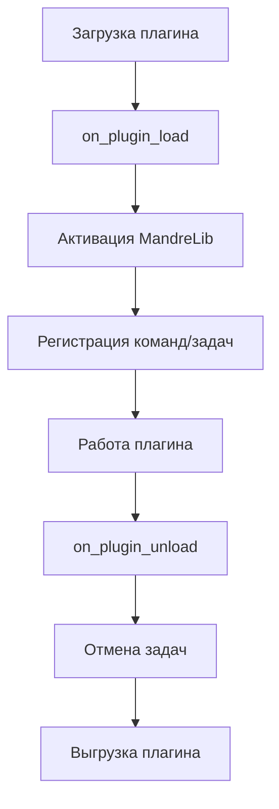

# Базовая интеграция

Подробное руководство по подключению MandreLib к вашему плагину.

## Импорт библиотеки

Чтобы использовать MandreLib, импортируйте необходимые модули:

```python
from mandre_lib import Mandre, MandreData, MandreUI, MandreTTS, MandreAuth
from base_plugin import BasePlugin
```

## Активация персистентного хранилища

Самая важная функция - автоматическое сохранение данных:

```python
class MyPlugin(BasePlugin):
    def on_plugin_load(self):
        # Активируем персистентное хранилище
        Mandre.use_persistent_storage(self)
        
        self.log("Плагин загружен, MandreLib активирована")
```

::: tip Что это даёт?
После активации все вызовы `self.set_setting(key, value)` автоматически сохраняются на диск. При следующей загрузке плагина данные восстанавливаются через `self.get_setting(key, default)`.
:::


## Полный шаблон плагина

```python
__id__ = "my_plugin"
__name__ = "Название плагина"
__version__ = "1.0.0"
__author__ = "@yourname"
__description__ = "Описание плагина"
__min_version__ = "11.9.0"

from base_plugin import BasePlugin, HookResult, HookStrategy
from ui.settings import Header, Text, Switch, Divider
from ui.bulletin import BulletinHelper
from mandre_lib import Mandre, MandreData, MandreUI

class MyPlugin(BasePlugin):
    def on_plugin_load(self):
        """Вызывается при загрузке плагина"""
        # Активируем MandreLib
        Mandre.use_persistent_storage(self)
        
        # Добавляем хуки если нужны
        self.add_on_send_message_hook()
        
        # Регистрируем команды
        Mandre.register_command(self, "mycommand", self.cmd_mycommand)
        
        # Запускаем задачи
        Mandre.schedule_task(self, "task_name", 60, self.periodic_task)
        
        self.log("Плагин загружен")
    
    def on_send_message_hook(self, params):
        """Обработка исходящих сообщений"""
        # Обрабатываем команды
        result = Mandre.handle_outgoing_command(params)
        if result:
            return result
        
        # Ваша дополнительная логика
        return HookResult()
    
    def cmd_mycommand(self, plugin, args, params):
        """Обработчик команды .mycommand"""
        BulletinHelper.show_info("Команда выполнена!")
        return None
    
    def periodic_task(self):
        """Периодическая задача"""
        self.log("Задача выполнена")
    
    def create_settings(self):
        """Создание UI настроек плагина"""
        return [
            Header(text="Настройки плагина"),
            Switch(
                text="Включить функцию",
                description="Описание функции",
                value=self.get_setting("feature_enabled", False),
                on_change=lambda v: self.set_setting("feature_enabled", v)
            ),
            Divider(),
            Text(
                text="О плагине",
                icon="msg_info",
                on_click=lambda _: BulletinHelper.show_info("Информация о плагине")
            )
        ]
    
    def on_plugin_unload(self):
        """Вызывается при выгрузке плагина"""
        # Отменяем все задачи
        Mandre.cancel_task(self, "task_name")
        
        self.log("Плагин выгружен")
```

## Жизненный цикл плагина



## Важные моменты

::: warning Персистентное хранилище
Всегда вызывайте `Mandre.use_persistent_storage(self)` в начале `on_plugin_load()`, иначе данные не будут сохраняться.
:::

::: danger Отмена задач
Обязательно отменяйте все запущенные задачи в `on_plugin_unload()`, иначе они будут работать даже после выгрузки плагина!
:::

::: tip Потокобезопасность
Все операции с данными в MandreLib потокобезопасны. Можно безопасно писать из фоновых потоков.
:::

## Следующие шаги

Теперь, когда вы знаете основы интеграции, изучите конкретные модули:

- [Хранилище данных](/guide/storage) - работа с JSON и файлами
- [UI компоненты](/guide/ui) - диалоги и уведомления
- [Команды](/guide/commands) - система команд
- [Планировщик](/guide/scheduler) - периодические задачи
